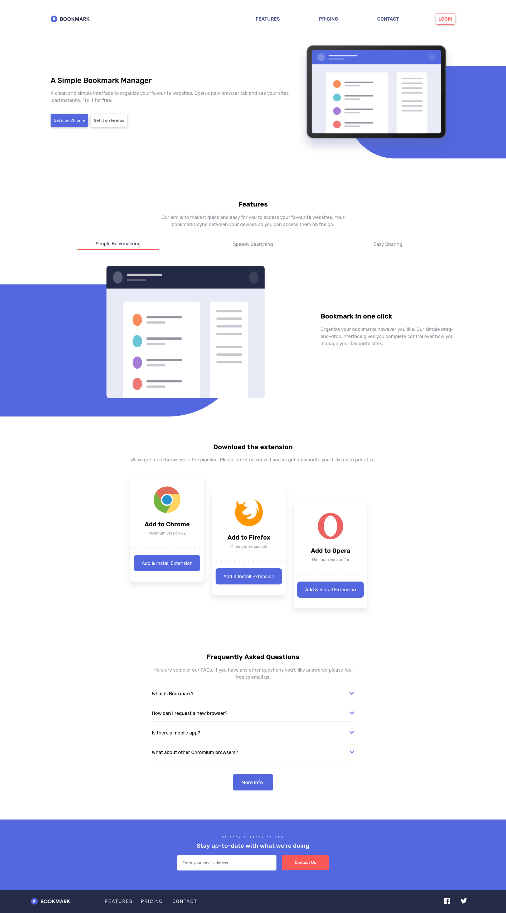

# Frontend Mentor - Bookmark landing page solution

This is a solution to the [Bookmark landing page challenge on Frontend Mentor](https://www.frontendmentor.io/challenges/bookmark-landing-page-5d0b588a9edda32581d29158). Frontend Mentor challenges help you improve your coding skills by building realistic projects. 

## Table of contents

- [Overview](#overview)
  - [The challenge](#the-challenge)
  - [Screenshot](#screenshot)
  - [Links](#links)
- [My process](#my-process)
  - [Built with](#built-with)
  - [What I learned](#what-i-learned)
  - [Continued development](#continued-development)
  - [Useful resources](#useful-resources)
- [Author](#author)

**Note: Delete this note and update the table of contents based on what sections you keep.**

## Overview

### The challenge

Users should be able to:

- View the optimal layout for the site depending on their device's screen size
- See hover states for all interactive elements on the page
- Receive an error message when the newsletter form is submitted if:
  - The input field is empty
  - The email address is not formatted correctly

### Screenshot



### Links

- Solution URL: [GitHub](https://github.com/OrtegaRamiro31/bookmark)
- Live Site URL: [Site](https://ortegaramiro31.github.io/bookmark/)

## My process

### Built with

- Semantic HTML5 markup
- SAAS
- Flexbox
- CSS Grid
- Mobile-first workflow
- Gulp
- JavaScript

### What I learned

I learned how to use positions absolutes and relatives, also learned how to create figures with CSS.

```css
    Parent
    position: relative;

    Child
    content: "";
    position: absolute;
    right: 0rem;
    top: 16rem;
    width: 65%;
    height: 15rem;
    background: hsl(231, 69%, 60%);
    z-index: -2;
    border-top-left-radius: 30% 50%;
    border-bottom-left-radius: 30% 50%;
```

### Continued development

- I still need to learn how to refactor the code better.
- Also i need to learn how to plain the projects better.
- Another important point is Git and Github. I had a lot of problems due to i cloned my project on another computer and it was difficult for me to go back to using Git Push.
- The final Point is that still i need to improve my english :p.
### Useful resources

- [Git Merge](https://stackoverflow.com/questions/14168677/merge-development-branch-with-master) - This helped me to merge branchs.
- [Relative and absolute positions](https://developer.mozilla.org/es/docs/Web/CSS/position) - This helped me to understand relative and absolute positions.
- [Transitions](https://developer.mozilla.org/en-US/docs/Web/CSS/transition) - This helped me to understandr how to make transitions. 

## Author

- Github - [@OrtegaRamiro31](https://github.com/OrtegaRamiro31)
- Frontend Mentor - [@OrtegaRamiro31](https://www.frontendmentor.io/profile/OrtegaRamiro31)
